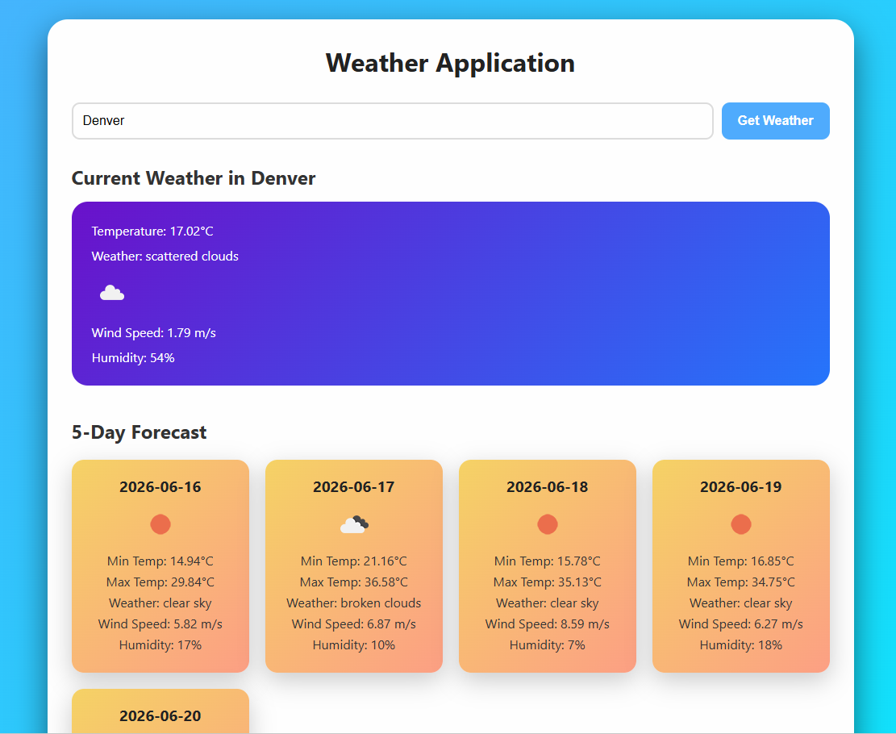

# Weather Application

React application that alllows viewers to search any city, view the current weather conditions, and see 5-day weather forecast.

The application uses 'OpenWeather'Map' API to retrieve real-time weather data and forecast information.

#### Live Demo: [https://react-weather-app-yb4e.onrender.com/](https://react-weather-app-yb4e.onrender.com/)

---

demo image

[

## Set-Up Instructions

### Requirements

* Node js installed
* NPM
* WeatherMap API key

### Installations

Installed dependencies

```bash
npm install
```

Create .env file in the project root, and add OpenWeatherMap API key.

```env
VITE_API_KEY=your_api_key goes here
```

Now start development server

```bash
npm run dev
```

Open browser

```plaintext
 http://localhost:5173/
```

## API used and endpoint(s)

The application uses the OpenWeatherMap API to retrieve weather data. The following endpoints are utilized:

1. **Current Weather Data**: This endpoint provides real-time weather information for a specific city. It includes details such as temperature, humidity, wind speed, and weather conditions.
   - Endpoint: `https://api.openweathermap.org/data/2.5/weather?q={city name}&appid={API key}`
2. **5-Day Weather Forecast**: This endpoint provides a 5-day weather forecast for a specific city, with data available in 3-hour intervals. It includes information such as temperature, humidity, wind speed, and weather conditions for each interval.
   - Endpoint: `https://api.openweathermap.org/data/2.5/forecast?q={city name}&appid={API key}`

## Any challenges or known bugs

* The forescast endpoint returns data in a 3-hour intervals rather than daily summaries.
* Forecast data needed to be grouped by date to create a clean 5-day forecast view.
* Handling invalid city searches and displaying appropriate error messages to the user.
